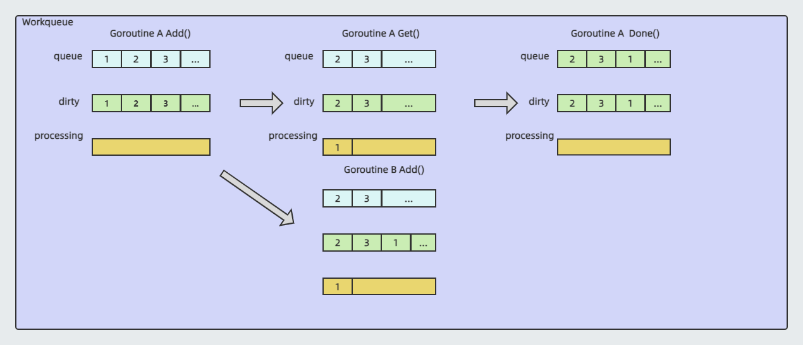
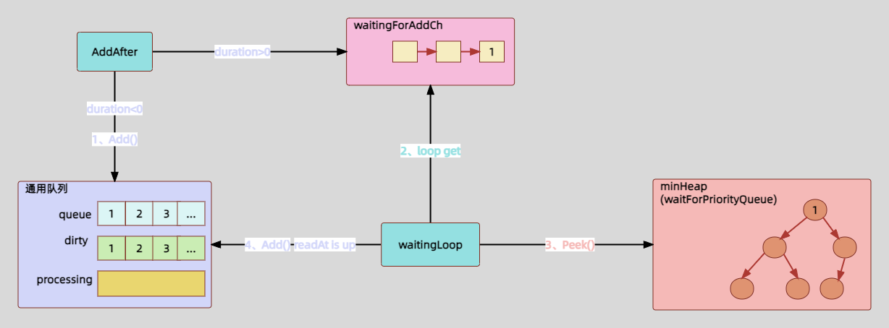

## 简介

上一篇文章梳理了 SharedInformer 的原理，知道事件存到 Indexer 中后，最后会被事件处理器处理。这个处理器可以是开发者自己实现的处理器，在前面章节 Informer 使用中的示例就是我们自己实现了 OnAdd、OnUpdate、OnDelete 这三个回调函数，从而实现处理器；

也可以利用 client-go 中的 Workqueue，将事件先写入到 Workqueue 中，然后再从这个 Workqueue 中获取事件再处理。这样的好处可以实现异步处理事件，事件处理的效率也会非常高。像 [sigs.io](http://sigs.io) 组织开发的 Controller-runtime 以及 k8s 内部组件使用 informer 的时候都是利用 Workqueue 来异步处理事件的。

Workqueue 有以下几个类型：

- 通用队列
- 延时队列
- 限速队列

下面就从源码的角度分析以上队列的作用以及原理，本篇基于 [k8s.io/client-go](http://k8s.io/client-go) v0.23.4 源码讲解。

## 通用队列

通用列队就是一个简单的先进先出的队列，在 Deltafifio 原理章节中说到过，Deltafifo 其本身也是个队列，这两个队列功能类似。

### 定义

先看看其 interface 定义，这个接口的功能具有一些队列的简单功能

```go
// k8s.io/client-go/util/workqueue/queue.go:26

type Interface interface {
	Add(item interface{})                   // 向队列新增元素
	Len() int                               // 计算队列长度
	Get() (item interface{}, shutdown bool) // 获取指定元素
	Done(item interface{})                  // 表明元素获取结束
	ShutDown()                              // 关闭队列
	ShutDownWithDrain()                     // 假关闭
	ShuttingDown() bool                     // 关闭是否成功
}
```

再看看这个接口是有哪个结构体实现的

```go

// k8s.io/client-go/util/workqueue/queue.go:72

type Type struct {
	// queue 是一个切片，用于存储元素，切片可用于顺序存储. 
	// queue 中每个元素都应该出现在 dirty 而不是 processing 中
	queue []t

	// dirty 存储每个需要处理的元素
	// dirty 是一个 set，用 map 实现
	dirty set

	// processing 中存储正在处理的元素.
	// 这些元素可能同时存在于 dirty 中. 
  // 当处理完这些元素时以及删除时，先检查这些元素是否在 dirty 中，如果在把它加入到上面 queue 中
	// processing 也是用 map 实现
	processing set
	// 并发控制
	cond *sync.Cond
	
	// 队列关闭标志
	shuttingDown bool
	drain        bool
	// 用于监控
	metrics queueMetrics

	unfinishedWorkUpdatePeriod time.Duration
	clock                      clock.WithTicker
}
```

为什么 Workqueue 需要设置 `queue、dirty、processing` 这三个字段来保存元素。

其中 `queue` 字段是实际存储元素的地方，它是 slice 结构的，用于保证元素有序；

`dirty` 字段非常关键，除了能保证去重，还能保证在处理一个元素之前哪怕其被添加了多次（并发情况下），但也只会被处理一次；

`processing` 字段用于标记机制，标记一个元素是否正在被处理。

### 方法实现

`Type` struct 实现了 Interface  这个接口，下面就具体看看这些方法的具体逻辑

首先看 `Add()` 方法，`Add()` 方法就是将元素添加到 Workqueue 中

```go
// k8s.io/client-go/util/workqueue/queue.go:120

// 增加元素
func (q *Type) Add(item interface{}) {
	q.cond.L.Lock()
	defer q.cond.L.Unlock()
	// 如果队列关闭，直接返回
	if q.shuttingDown {
		return
	}
	// 如果 dirty 中存在该元素，直接返回
	if q.dirty.has(item) {
		return
	}

	q.metrics.add(item)
	// 能到这一步说明可以添加元素了，把该元素添加到 dirty 中
	q.dirty.insert(item)
	// 如果 processing 中存在该队列，说明该元素正在被处理，直接返回
	if q.processing.has(item) {
		return
	}
	// 该元素是个新元素，添加到 queue
	q.queue = append(q.queue, item)
	// 解锁其他阻塞协程
	q.cond.Signal()
}
```

Workqueue 存在元素，就会有消费者去消费该元素，消费者通过 `Get()` 方法来获取元素

```go
// k8s.io/client-go/util/workqueue/queue.go:153
// 获取元素
func (q *Type) Get() (item interface{}, shutdown bool) {
	q.cond.L.Lock()
	defer q.cond.L.Unlock()
	// 如果 queue 没有元素而且队列不是关闭的，则阻塞当前协程
	for len(q.queue) == 0 && !q.shuttingDown {
		q.cond.Wait()
	}
	// queue 中没有元素，到这一步说明队列正在关闭，直接返回
	if len(q.queue) == 0 {
		// We must be shutting down.
		return nil, true
	}
	// 获取 queue 第一个元素
	item = q.queue[0]
	// 将第一个元素设置为 nil, 用于 gc
	q.queue[0] = nil
	// 重新设置queue
	q.queue = q.queue[1:]

	q.metrics.get(item)
	// 将该元素添加到 processing，说明这个元素正在处理
	q.processing.insert(item)
	// 将该元素从 dirty 删除
	q.dirty.delete(item)
	// 返回该元素
	return item, false
}
```

获取到元素就要被处理，处理完需要表示该元素已经处理完毕，通过调用 `Done()`

```go
// k8s.io/client-go/util/workqueue/queue.go:180

// Done() 用于表示该元素处理完成
func (q *Type) Done(item interface{}) {
	q.cond.L.Lock()
	defer q.cond.L.Unlock()

	q.metrics.done(item)
	// 从 processing 删除该元素，说明该元素已经处理完成
	q.processing.delete(item)
	// 如果 dirty 中还在存在该元素，就说明这个元素在处理过程中有其他协程有重新将该元素添加到队列中
	// 这时候将该元素重新添加到 queue 中
	// 解锁其他阻塞协程
	if q.dirty.has(item) {
		q.queue = append(q.queue, item)
		q.cond.Signal()
	} else if q.processing.len() == 0 {
		q.cond.Signal()
	}
}
```

### 场景示例

通过上面三个 `Add()、Get()、Done()` 方法逻辑解释，大体知道元素是怎么被处理的了，但是里面涉及到 `queue、dirty、processing` 三个数据结构的联系。

那么这三个数据结构的作用到底是什么，为什么 Workqueue 会这样设计。

**非并发的场景：**

1、通过 `Add()` 方法向 Workqueue 中分别添加 1、2、3 这三个元素，根据上述 Add() 源码分析知道 `dirty、queue` 存在 1、2、3 元素，`processing` 为空。

2、然后通过 `Get()` 获取第一个元素，也就是 1 元素，根据上述 `Get()` 知道此时队列中的 `queue` 和 `dirty` 字段分别存有 2、3 元素，且 1 元素会被添加到 `proceessing` 中，表示 1 元素正在处理。

3、最后当处理完这个元素后，通过 `Done()` 标记该元素已经处理完成，根据上述 `Done()` 源码知道此时队列中 `processing` 字段中的 1 元素会被删除

上述分析如下图所示：


**并发场景：**

上面看的是非并发场景，看起来 `dirty` 的作用不是很大，在并发场景下就可以看出 `dirty` 的设计意图了

1、Goroutine A 通过 `Add()` 方法向 Workqueue 中分别添加 1、2、3 这三个元素，根据上述 `Add()` 源码分析知道 `dirty、queue` 存在 1、2、3 元素，`processing` 为空。

2、Goroutine A 通过 `Get()` 方法获取 1 元素，1 元素被添加到 `processing` 中。同一时间，Goroutine B 通过 `Add()` 方法插入另一个 1 元素，根据 `Add()` 源码知道此时会将该 1 元素添加到 `dirty` 中，同时在 `processing` 中已经存在 1 元素，所以后面的 1 元素并不会被直接添加到 `queue` 字段中。这样就保证 1 元素不会被其他协程获取并发处理。当前 Workqueue 中的 `dirty` 中存有 1、2、3 元素，`processing` 字段存有 1 元素。

3、在 Goroutine A 通过 `Done()` 方法标记处理完成后，如果 `dirty` 中存有 1 元素，则将 1 元素追加到 `queue` 字段中的尾部。所以就可以再次处理该元素了，保证刚刚 Goroutine B 添加的 1 元素不会被漏掉。需要注意的是，`dirty` 和 `processing` 字段都是用 Hash Map 数据结构实现的，所以不需要考虑无序，只保证去重即可。

上述分析如下图所示：



到这就理解了 Workqueue 通用队列的原理了，下面再看看延迟队列

## 延迟队列

延迟队列是在通用队列基础上扩展了延迟入队列的功能

### 定义

先看看其接口

```go
// k8s.io/client-go/util/workqueue/delaying_queue.go:30

// 延迟队列可以等待某一时间后再入队列
type DelayingInterface interface {
	// 这就是上面说的通用队列
	Interface
	// 这个方法是等待某个时间点后再添加元素到队列
	AddAfter(item interface{}, duration time.Duration)
}
```

再看看其实现的结构体

```go
// k8s.io/client-go/util/workqueue/delaying_queue.go:73

// delayingType 包装了通用队列并且提供延迟返回队列的功能
type delayingType struct {
	Interface

	// 延迟时钟
	clock clock.Clock

	// 用于退出循环
	stopCh chan struct{}
	// stopOnce 保证只调用一次
	stopOnce sync.Once

	// heartbeat ensures we wait no more than maxWait before firing
	heartbeat clock.Ticker

	// waitingForAddCh 是一个 channel，用于缓存需要延迟入队的元素
	waitingForAddCh chan *waitFor

	// metrics counts the number of retries
	metrics retryMetrics
}

// waitFor 对元素、等待时间进行封装
type waitFor struct {
	// 具体元素
	data    t
	// 延时时间
	readyAt time.Time
	// 在小顶堆的优先级
	index int
}
```

在看延时队列具体方法之前需要先了解一个重要属性 `waitForPriorityQueue` ，

### 优先级队列

`waitForPriorityQueue` 是一个元素为 `*waitFor` 的切片，`waitFor` 是一个元素和延时时间的封装数据结构。`waitForPriorityQueue` 不仅保存了 `waitFor` 同时还按照元素的延时时间按照从小到大顺序排列，达到优先级队列的效果。

为什么延时队列需要这个数据结构，因为每个延时元素都会有个未来执行的时间戳，所以这个时间戳需要有个优先级，`waitForPriorityQueue` 按照时间戳大小设置优先级

```go
// k8s.io/client-go/util/workqueue/delaying_queue.go:110

type waitForPriorityQueue []*waitFor
```

`waitForPriorityQueue` 实际上是这个接口的一个实现，这个接口是 golang 内置 interface

```go
// container/heap/heap.go:31

type Interface interface {
	sort.Interface
	Push(x any) // add x as element Len()
	Pop() any   // remove and return element Len() - 1.
}
```

下面看看 `waitForPriorityQueue` 是如何实现这个接口的

其中 `Len()、Less()、Swap()` 是 sort.Interface 中的方法

```go
// k8s.io/client-go/util/workqueue/delaying_queue.go:112

func (pq waitForPriorityQueue) Len() int {
	return len(pq)
}
func (pq waitForPriorityQueue) Less(i, j int) bool {
	// 比较元素的时间大小
	return pq[i].readyAt.Before(pq[j].readyAt)
}
func (pq waitForPriorityQueue) Swap(i, j int) {
	// 根据时间大小设置 index
	pq[i], pq[j] = pq[j], pq[i]
	pq[i].index = i
	pq[j].index = j
}

// Push 将元素添加到 waitForPriorityQueue. 
// Push 不应该被直接调用，而是使用 heap.Push
func (pq *waitForPriorityQueue) Push(x interface{}) {
	n := len(*pq)
	item := x.(*waitFor)
	item.index = n
	*pq = append(*pq, item)
}

// Pop 将元素从 waitForPriorityQueue 移除
// Pop 不应该被直接调用，而是使用 heap.Pop
func (pq *waitForPriorityQueue) Pop() interface{} {
	n := len(*pq)
	item := (*pq)[n-1]
	item.index = -1
	*pq = (*pq)[0:(n - 1)]
	return item
}
```

大致了解了 `waitForPriorityQueue` 作用就看看延时队列具体方法，以及如何使用 `waitForPriorityQueue`  的。

### 方法实现

`delayingType` struct 实现了 `DelayingInterface` interface，下面具体看看其实现逻辑

`delayingType` struct 只需实现 `AddAfter()` 即可，因为 `delayingType` struct 继承了通用队列的方法

```go
// k8s.io/client-go/util/workqueue/delaying_queue.go:160

// AddAfter 等待某个时间后再加入队列
func (q *delayingType) AddAfter(item interface{}, duration time.Duration) {
	// 如果 workqueue 正在关闭则无需入队，直接返回
	if q.ShuttingDown() {
		return
	}

	q.metrics.retry()

	// 如果延时时间小于 0，则直接添加到队列
	if duration <= 0 {
		q.Add(item)
		return
	}

	select {
	case <-q.stopCh:
		// 将元素封装成 waitFor 添加到 waitingForAddCh channel 中，等待消费
	case q.waitingForAddCh <- &waitFor{data: item, readyAt: q.clock.Now().Add(duration)}:
	}
}
```

可以知道元素被添加到 `waitingForAddCh` channel 中，那肯定会有消费者从这个 channel 获取元素进行处理，这个消费者就是 `delayingType` 的 `waitingLoop()`，这个方法是 `delayingType` 初始化的时候开启一个协程不断运行的。

主要逻辑：`waitingLoop()` 就是不断从 `waitingForAddCh` channel 中消费数据，然后根据 `waitForPriorityQueue` 优先级队列将元素添加到通用队列中。

```go
// k8s.io/client-go/util/workqueue/delaying_queue.go:187

// waitingLoop 从 waitingForAddCh 获取数据并添加到通用队列中，知道队列关闭才会退出
func (q *delayingType) waitingLoop() {
	defer utilruntime.HandleCrash()

	// never 表示无限延长定时
	never := make(<-chan time.Time)

	// 定时器, 每个元素等待时间
	var nextReadyAtTimer clock.Timer
	
	// waitForPriorityQueue 是一个切片，其切片元素是 waitingForAddCh 
	// 这个切片里的元素是按照元素延时时间大小进行排序的
	waitingForQueue := &waitForPriorityQueue{}
	// 初始化小顶堆
	heap.Init(waitingForQueue)

	// waitingEntryByData 用于判断元素是否重复
	waitingEntryByData := map[t]*waitFor{}
	
	// 死循环
	for {
		// 如果通过队列正在关闭，则直接返回
		if q.Interface.ShuttingDown() {
			return
		}
		
		// 设置当前时间
		now := q.clock.Now()

		// 如果 waitingForQueue 中一直存在元素，则一直处理
		for waitingForQueue.Len() > 0 {
			// 获取 waitingForQueue 第一个元素
			entry := waitingForQueue.Peek().(*waitFor)
			// 如果该元素的延时时间大于当前时间，说明处理时间还没到，直接退出循环
			// 因为 waitingForQueue 是按照延时时间排序的，第一个元素的时间最小，后面的肯定比当前时间都
			if entry.readyAt.After(now) {
				break
			}
			// 将该元素从 waitingForQueue 删除
			entry = heap.Pop(waitingForQueue).(*waitFor)
			// 将该元素加入到通用队列中
			q.Add(entry.data)
			// 将该元素从 waitingEntryByData 删除
			delete(waitingEntryByData, entry.data)
		}

		// 先设置定时器为无限
		nextReadyAt := never
		// 到这一步，说明上面的循环执行完成或者退出了，执行完成的话则下面的步骤会阻塞掉
		// 如果上面循环执行退出，说明第一个元素还没到时间，如果 waitingForQueue 还存在元素
		if waitingForQueue.Len() > 0 {
			if nextReadyAtTimer != nil {
				nextReadyAtTimer.Stop()
			}
			// 获取第一个元素
			entry := waitingForQueue.Peek().(*waitFor)
			// 将第一个元素减去当前时间作为等待时间
			nextReadyAtTimer = q.clock.NewTimer(entry.readyAt.Sub(now))
			nextReadyAt = nextReadyAtTimer.C()
		}

		select {
		case <-q.stopCh:
			return
		// 定时执行，超过 10 秒，执行下次循环
		case <-q.heartbeat.C():
		// 不断执行定时器，时间到了，则执行下一次循环，下一次循环该元素会被处理
		case <-nextReadyAt:
		// 时间没到, 从 waitingForAddCh 获取到元素
		case waitEntry := <-q.waitingForAddCh:
			// 如果还没到时
			if waitEntry.readyAt.After(q.clock.Now()) {
				// 将该元素插入到添加到 waitingForQueue、waitingEntryByData
				insert(waitingForQueue, waitingEntryByData, waitEntry)
			} else {
				// 如果元素到时，则直接添加到通用队列中
				q.Add(waitEntry.data)
			}
			
			// 这是一个性能优化，尽量在本次 case 把数据全部处理完，避免每次都唤醒上层 case
			drained := false
			for !drained {
				select {
				case waitEntry := <-q.waitingForAddCh:
					if waitEntry.readyAt.After(q.clock.Now()) {
						insert(waitingForQueue, waitingEntryByData, waitEntry)
					} else {
						q.Add(waitEntry.data)
					}
				default:
					drained = true
				}
			}
		}
	}
}
```

### 总结

延时队列的执行流程可以用下图解释：

1、调用 `AddAfter()` 根据 `duration` 大小将元素添加到 `waitingForAddCh` channel 中或者通用队列中

2、`waitingLoop` 不断获取 `waitingForAddCh` 将元素添加到 `waitForPriorityQueue` 中设置优先级

3、最终各个元素延时时间到了都是添加到通用队列等待处限速队列



## 限速队列

见名知意，限速队列是对元素进行限速，也就是延迟元素入队，利用限速队列获取延时入队的时间。所以限速队列也是在延时队列的基础上扩展功能，下面看看其定义

### 定义

同样先看接口

```go
// k8s.io/client-go/util/workqueue/rate_limiting_queue.go:19

// RateLimitingInterface 限制元素入队列的速度
type RateLimitingInterface interface {
	// 继承延时队列
	DelayingInterface

	// AddRateLimited 的作用是等限速器说 ok 的时候，将元素加入到 workqueue 
	AddRateLimited(item interface{})

	// Forget 表示忘记该元素，也就是这个元素后续不会被处理了 
	// Forget 只是清理了限速器，还是需要调用通用队列的 Done 来结束元素使用
	Forget(item interface{})

	// NumRequeues 获取元素重新入对的次数
	NumRequeues(item interface{}) int
}
```

`RateLimitingInterface` 继承了 `DelayingInterface`，然后扩展了几个方法

再看看实现 `RateLimitingInterface` 的 struct

```go
// k8s.io/client-go/util/workqueue/rate_limiting_queue.go:52

// rateLimitingType 封装了延时队列，并扩展了限速器
type rateLimitingType struct {
	// 延时队列
	DelayingInterface
	// 限速器
	rateLimiter RateLimiter
}

// k8s.io/client-go/util/workqueue/default_rate_limiters.go:27
type RateLimiter interface {
	// When 获取元素延时时间
	When(item interface{}) time.Duration
	// Forget 忘记元素
	Forget(item interface{})
	// NumRequeues 返回元素重新回队列的次数
	NumRequeues(item interface{}) int
}
```

### 方法实现

`rateLimitingType` 只需实现 `AddRateLimited(item interface{})、Forget(item interface{})、NumRequeues(item interface{})`  即可

```go
// k8s.io/client-go/util/workqueue/rate_limiting_queue.go:59

// AddRateLimited 的作用是当限速器说 ok 的时候，将元素 AddAfter 到队列中
func (q *rateLimitingType) AddRateLimited(item interface{}) {
	// 调用延时队列的 AddAfter()，延时时间通过调用限速器获取
	q.DelayingInterface.AddAfter(item, q.rateLimiter.When(item))
}

func (q *rateLimitingType) NumRequeues(item interface{}) int {
	// 调用限速器的方法获取重新回队列的次数
	return q.rateLimiter.NumRequeues(item)
}

func (q *rateLimitingType) Forget(item interface{}) {
	// 调用限速器的方法忘记该元素
	q.rateLimiter.Forget(item)
}
```

`rateLimitingType` 实现了限速队列的方法，实际上调用的是限速器 `rateLimiter` 的方法，所以下面看看几种限速器 `rateLimiter` 的具体实现

### BucketRateLimiter(令牌桶限速器)

`BucketRateLimiter`（令牌桶限速器），这是一个固定速率（qps）的限速器，该限速器是利用 `golang.org/x/time/rate` 库来实现的，令牌桶算法内部实现了一个存放 token（令牌）的“桶”，初始时“桶”是空的，token 会以固定速率往“桶”里填充，直到将其填满为止，多余的 token 会被丢弃。每个元素都会从令牌桶得到一个 token，只有得到 token 的元素才允许通过，而没有得到 token 的元素处于等待状态。令牌桶算法通过控制发放 token 来达到限速目的。

令牌桶是有一个固定大小的桶，系统会以恒定的速率向桶中放 Token，桶满了就暂时不放了，而用户则从桶中取 Token，如果有剩余的 Token 就可以一直取，如果没有剩余的 Token，则需要等到系统中放置了 Token 才行。

令牌桶算法实现的限速器其处理元素的频率是固定的，可以处理尖峰流量，实现平滑限流，控制在一定频率来执行。

看看其定义

```go
// k8s.io/client-go/util/workqueue/default_rate_limiters.go:48

// BucketRateLimiter 使用 golang 自带的令牌桶限速器实现
type BucketRateLimiter struct {
	*rate.Limiter
}
```

再看看 `BucketRateLimiter` 是如何实现 `RateLimiter` 接口的

```go
// k8s.io/client-go/util/workqueue/default_rate_limiters.go:54

func (r *BucketRateLimiter) When(item interface{}) time.Duration {
	// 调用 golang 自带限速器获取元素延时时间
	return r.Limiter.Reserve().Delay()
}

func (r *BucketRateLimiter) NumRequeues(item interface{}) int {
	// 因为是固定频率，重新入队的次数没有什么作用，直接返回 0 
	return 0
}

func (r *BucketRateLimiter) Forget(item interface{}) {
	// 不需要重新入队的次数，也无需忘记元素
}
```

### ItemExponentialFailureRateLimiter(指数递增失败限速器)

`ItemExponentialFailureRateLimiter` 这个队列从字面意思解释是元素错误次数指数递增限速器，他会根据元素错误次数逐渐累加等待时间

其定义如下：

```go
// k8s.io/client-go/util/workqueue/default_rate_limiters.go:67

// 当对象处理失败的时候，其再次入队的等待时间 × 2，到 MaxDelay 为止，直到超过最大失败次数
type ItemExponentialFailureRateLimiter struct {
	// 操作失败数的互斥锁
	failuresLock sync.Mutex
	// 元素失败次数
	failures     map[interface{}]int
	// 基准延时时间
	baseDelay time.Duration
	// 最大延时时间
	maxDelay  time.Duration
}
```

下面同样看看这个限速器是如何实现限速器接口的

```go
// k8s.io/client-go/util/workqueue/default_rate_limiters.go:89

func (r *ItemExponentialFailureRateLimiter) When(item interface{}) time.Duration {
	r.failuresLock.Lock()
	defer r.failuresLock.Unlock()
	// 获取该元素的失败次数
	exp := r.failures[item]
	// 累加该元素失败次数
	r.failures[item] = r.failures[item] + 1

	// 通过错误次数计算延时时间，按照 2^i * baseDelay，所以是指数递增
	backoff := float64(r.baseDelay.Nanoseconds()) * math.Pow(2, float64(exp))
	// 如果计算延时时间大于计算机的最大时间，则最大延时时间
	if backoff > math.MaxInt64 {
		return r.maxDelay
	}
	// 计算延时时间
	calculated := time.Duration(backoff)
	// 如果计算时间大于设置的最大延时，则返回最大延时
	if calculated > r.maxDelay {
		return r.maxDelay
	}
	// 否则返回计算的延时s
	return calculated
}

func (r *ItemExponentialFailureRateLimiter) NumRequeues(item interface{}) int {
	r.failuresLock.Lock()
	defer r.failuresLock.Unlock()
	// 返回该元素失败次数
	return r.failures[item]
}

func (r *ItemExponentialFailureRateLimiter) Forget(item interface{}) {
	r.failuresLock.Lock()
	defer r.failuresLock.Unlock()
	// 将该元素从失败集合中删除，后续都不会处理了
	delete(r.failures, item)
}
```

通过上面的分析，`ItemExponentialFailureRateLimiter` 计算出来的元素延时时间按照 元素失败次数的指数递增算出来的。

### **ItemFastSlowRateLimiter(元素快慢限速器)**

`ItemFastSlowRateLimiter` （快慢限速器）和 `ItemExponentialFailureRateLimiter` 很像，都是用于错误尝试的，但是 `ItemFastSlowRateLimiter` 的限速策略是尝试次数超过阈值用长延迟，否则用短延迟，不过该限速器很少使用。

看看其定义：

```go
//  k8s.io/client-go/util/workqueue/default_rate_limiters.go:124

// ItemFastSlowRateLimiter 先以 fastDelay 为周期进行尝试，超过 maxFastAttempts 次数后，按照 slowDelay 为周期进行尝试
type ItemFastSlowRateLimiter struct {
	// 互斥锁
	failuresLock sync.Mutex
	// 元素失败次数
	failures     map[interface{}]int
	// 最大快尝试次数
	maxFastAttempts int
	// 快即表示时间短，短延时
	fastDelay       time.Duration
	// 长延时
	slowDelay       time.Duration
}
```

下面同样看看这个限速器是如何实现限速器接口的

```go
// k8s.io/client-go/util/workqueue/default_rate_limiters.go:145

func (r *ItemFastSlowRateLimiter) When(item interface{}) time.Duration {
	r.failuresLock.Lock()
	defer r.failuresLock.Unlock()
	// 累加失败次数
	r.failures[item] = r.failures[item] + 1
		// 如果失败次数小于最大快延时的尝试次数
	if r.failures[item] <= r.maxFastAttempts {
		// 使用短延时
		return r.fastDelay
	}
	// 否则使用长延时
	return r.slowDelay
}

func (r *ItemFastSlowRateLimiter) NumRequeues(item interface{}) int {
	r.failuresLock.Lock()
	defer r.failuresLock.Unlock()
	// 获取失败次数
	return r.failures[item]
}

func (r *ItemFastSlowRateLimiter) Forget(item interface{}) {
	r.failuresLock.Lock()
	defer r.failuresLock.Unlock()
	// 将该元素从失败集合中删除，后续都不会处理了
	delete(r.failures, item)
}
```

可以发现 `ItemFastSlowRateLimiter` 与 `ItemExponentialFailureRateLimiter` 的区别主要是 `When()` 方法实现有点区别，其余方法都是一样的。

### MaxOfRateLimiter(混合限速器)

`MaxOfRateLimiter` 内部有多个限速器，选择所有限速器中**速度最慢**（延迟最大）的一种方案。比如内部有三个限速器，`When()` 接口返回的就是三个限速器里面延迟最大的。

```go
// k8s.io/client-go/util/workqueue/default_rate_limiters.go:175

type MaxOfRateLimiter struct {
	// 限速器切片，可以使用多个限速器
	limiters []RateLimiter
}

func (r *MaxOfRateLimiter) When(item interface{}) time.Duration {
	ret := time.Duration(0)
	// 遍历每个限速器，计算该元素的延时时间, 取时间最长的
	for _, limiter := range r.limiters {
		curr := limiter.When(item)
		if curr > ret {
			ret = curr
		}
	}

	return ret
}

func (r *MaxOfRateLimiter) NumRequeues(item interface{}) int {
	ret := 0
	// 遍历每个限速器，计算重试最多的次数
	for _, limiter := range r.limiters {
		curr := limiter.NumRequeues(item)
		if curr > ret {
			ret = curr
		}
	}

	return ret
}

func (r *MaxOfRateLimiter) Forget(item interface{}) {
	// 遍历每个限速器，每个限速器都忘记该元素
	for _, limiter := range r.limiters {
		limiter.Forget(item)
	}
}
```

### WithMaxWaitRateLimiter(最大等待限速器)

`WithMaxWaitRateLimiter` 设置了最大延时时间，避免等待时间过长

```go
// k8s.io/client-go/util/workqueue/default_rate_limiters.go:219

type WithMaxWaitRateLimiter struct {
	limiter  RateLimiter
	// 最大等待时间
	maxDelay time.Duration
}

func (w WithMaxWaitRateLimiter) When(item interface{}) time.Duration {
	// 调用限速器获取延时时间
	delay := w.limiter.When(item)
	// 如果延时时间大于最大延时，则返回最大延时
	if delay > w.maxDelay {
		return w.maxDelay
	}

	return delay
}

func (w WithMaxWaitRateLimiter) Forget(item interface{}) {
	w.limiter.Forget(item)
}

func (w WithMaxWaitRateLimiter) NumRequeues(item interface{}) int {
	return w.limiter.NumRequeues(item)
}
```

### 默认限速器

到这里就把限速队列中所有的限速器都梳理了一遍，在 Client-go 中，默认使用的限速器类型是 `MaxOfRateLimiter`

```go
// k8s.io/client-go/util/workqueue/default_rate_limiters.go:37

// DefaultControllerRateLimiter 设置了ItemExponentialFailureRateLimiter 和 BucketRateLimiter 两个限速器 
func DefaultControllerRateLimiter() RateLimiter {
	return NewMaxOfRateLimiter(
		// 初始化 ExponentialFailureRateLimiter，基准为 5ms，最大延时时间 1000s
		NewItemExponentialFailureRateLimiter(5*time.Millisecond, 1000*time.Second),
		// 初始化 BucketRateLimiter，一秒钟塞入 10 个token，桶内最大token数为 100
		&BucketRateLimiter{Limiter: rate.NewLimiter(rate.Limit(10), 100)},
	)
}
```

Workqueue 中默认限速器是 `MaxOfRateLimiter`，其初始化了 `ItemExponentialFailureRateLimiter` 和 `BucketRateLimiter` ，这样每次计算延时时间都是根据这两个限速器给出的最大值。

说了这么多的限速器，实际上就是为延时队列计算延时时间，达到限速的效果。

## 总结

Workqueue 中有通用队列、延时队列、限速队列，但是通过上面的分析，延时队列依赖通用队列、限速队列依赖延时队列。

大致关系如下图所示：


讲完了 Workqueue 的原理，在之前 Client-go 架构图中又可以添加 Workqueue 模块了


下一章节就是讲解 Workqueue 是如何使用的