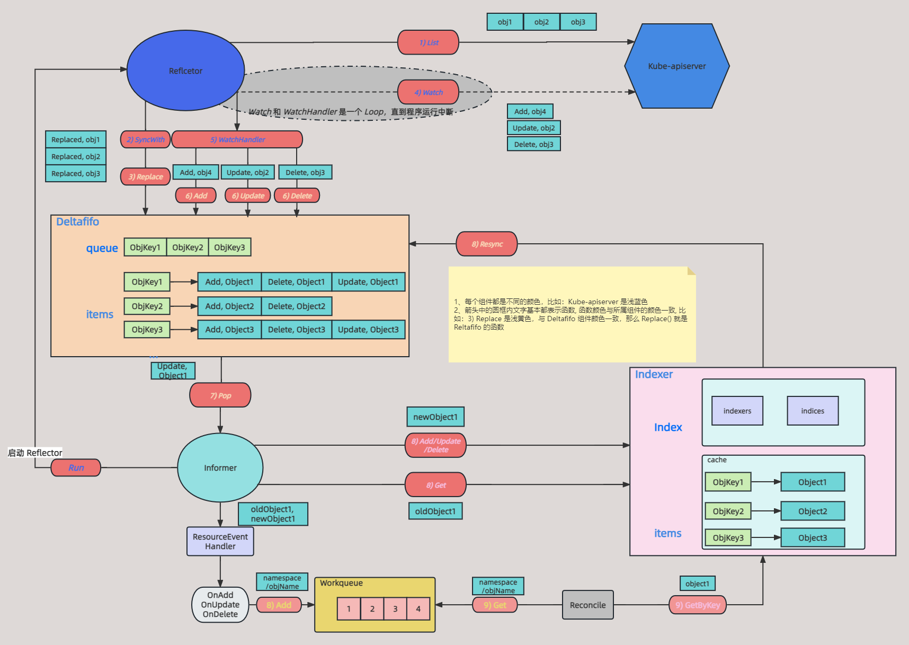

## 简介

上一篇文章 [<< Workqueue 原理 >>](https://www.sfernetes.com/client-go-workqueue/) 把 Workqueue 的作用以及几个队列类型都通过源码的方式梳理了一遍。

之前一篇文章 [<< Client-go Informer 使用 >>](https://www.sfernetes.com/client-go-informer-use/) 通过一个示例演示了 Informer 的用法，这个示例中，Informer 中的三个回调函数都是把获取到的事件直接拿来处理，这样事件量大了，就会存在并发瓶颈。

下面也是通过一个示例，演示 Informer 结合 Workqueue 将获取到的事件元素先添加到 Workqueue 中，而不是直接处理事件元素。然后再通过协程不断消费 Workqueue 进而处理元素。这样把生产，消费实现了解耦，达到异步处理效果，提高效率。

## 实现

如果自定义一个带 Workqueue 功能的控制器，这个控制器需要 Informer 来协调运行各个子组件，如 Reflector、Deltafifo，然后需要 Workqueue，将事件元素添加到 Workqueue 中，最后还需要 indexer，在最后逻辑处理元素时都是从 indexer 中获取真正的对象。

### 代码

```go
import (
	"flag"
	"fmt"
	"os"
	"path/filepath"
	"time"

	v1 "k8s.io/api/core/v1"
	"k8s.io/apimachinery/pkg/util/runtime"
	"k8s.io/apimachinery/pkg/util/wait"
	"k8s.io/client-go/informers"
	"k8s.io/client-go/kubernetes"
	"k8s.io/client-go/tools/cache"
	"k8s.io/client-go/tools/clientcmd"
	"k8s.io/client-go/util/workqueue"
	"k8s.io/klog/v2"
)

// 定义控制器, 控制器包括 informer、workqueue、indexer
type Controller struct {
	indexer  cache.Indexer
	queue    workqueue.RateLimitingInterface
	informer cache.Controller
}

// Run 启动 informer, 以及开启协程消费 workqueue 中的元素
func (c *Controller) Run(threadiness int, stopCh chan struct{}) {
	// 错误处理
	defer runtime.HandleCrash()

	// 停止控制器后关掉队列
	defer c.queue.ShutDown()
	klog.Info("Starting Pod controller")

	// 启动 informer
	go c.informer.Run(stopCh)

	// 等待所有相关的缓存同步，然后再开始处理队列中的项目
	if !cache.WaitForCacheSync(stopCh, c.informer.HasSynced) {
		runtime.HandleError(fmt.Errorf("Timed out waiting for caches to sync"))
		return
	}

	// 从协程池中运行消费者
	for i := 0; i < threadiness; i++ {
		go wait.Until(c.runWorker, time.Second, stopCh)
	}

	<-stopCh
	klog.Info("Stopping Pod controller")
}

// 循环处理元素
func (c *Controller) runWorker() {
	for c.processNextItem() {
	}
}

// 处理元素
func (c *Controller) processNextItem() bool {
	// 等到工作队列中有一个新元素, 如果没有元素会阻塞
	key, quit := c.queue.Get()
	if quit {
		return false
	}
	// 告诉队列我们已经完成了处理此 key 的操作
	// 这将为其他 worker 解锁该 key
	// 这将确保安全的并行处理，因为永远不会并行处理具有相同 key 的两个Pod
	defer c.queue.Done(key)

	// 调用包含业务逻辑的方法
	err := c.syncToStdout(key.(string))
	// 如果在执行业务逻辑期间出现错误，则处理错误
	c.handleErr(err, key)
	return true
}

// syncToStdout 是控制器的业务逻辑实现
// 在此控制器中，它只是将有关 Pod 的信息打印到 stdout
// 如果发生错误，则简单地返回错误
// 此外重试逻辑不应成为业务逻辑的一部分。
func (c *Controller) syncToStdout(key string) error {
	// 从 indexer 获取 key 对应的对象
	obj, exists, err := c.indexer.GetByKey(key)
	if err != nil {
		klog.Errorf("Fetching object with key %s from store failed with %v", key, err)
		return err
	}
	if !exists {
		fmt.Printf("Pod %s does not exists anymore\n", key)
	} else {
		fmt.Printf("Sync/Add/Update for Pod %s\n", obj.(*v1.Pod).GetName())
	}
	return nil
}

// 检查是否发生错误，并确保我们稍后重试
func (c *Controller) handleErr(err error, key interface{}) {
	if err == nil {
		// 忘记每次成功同步时 key, 下次不会再被处理, 除非事件被 resync
		c.queue.Forget(key)
		return
	}
	//如果出现问题，此控制器将重试5次
	if c.queue.NumRequeues(key) < 5 {
		klog.Infof("Error syncing pod %v: %v", key, err)
		// 重新加入 key 到限速队列
		// 根据队列上的速率限制器和重新入队历史记录，稍后将再次处理该 key
		c.queue.AddRateLimited(key)
		return
	}
	c.queue.Forget(key)
	// 多次重试，我们也无法成功处理该key
	runtime.HandleError(err)
	klog.Infof("Dropping pod %q out of the queue: %v", key, err)
}

func main() {
	var kubeConfig *string

	if h := homeDir(); h != "" {
		kubeConfig = flag.String("kubeconfig", filepath.Join(h, ".kube", "config"), "use kubeconfig access to kubeapiserver")
	} else {
		kubeConfig = flag.String("kubeconfig", "", "use kubeconfig access to kubeapiserver")
	}

	config, err := clientcmd.BuildConfigFromFlags("", *kubeConfig)
	if err != nil {
		panic(err.Error())
	}
	clientSet, err := kubernetes.NewForConfig(config)
	if err != nil {
		panic(err.Error())
	}

	// 初始化 workqueue, 使用限速队列
	queue := workqueue.NewRateLimitingQueue(workqueue.DefaultControllerRateLimiter())
	// 初始化 sharedInformer
	informerFactory := informers.NewSharedInformerFactoryWithOptions(clientSet, 0, informers.WithNamespace("nginx"))
	podInformer := informerFactory.Core().V1().Pods().Informer()
	// 注册回调函数到 informer
	podInformer.AddEventHandler(cache.ResourceEventHandlerFuncs{
		// 元素新增时，直接将事件元素添加到 Workqueue 
		AddFunc: func(obj interface{}) {
			key, err := cache.MetaNamespaceKeyFunc(obj)
			if err == nil {
				fmt.Println("add pod: ", key)
				queue.Add(key)
			}
		},
		// 元素更新时，直接将事件元素添加到 Workqueue 
		UpdateFunc: func(oldObj, newObj interface{}) {
			key, err := cache.MetaNamespaceKeyFunc(newObj)
			if err == nil {
				fmt.Println("update pod: ", key)
				queue.Add(key)
			}
		},
		// 元素删除时，直接将事件元素添加到 Workqueue 
		DeleteFunc: func(obj interface{}) {
			key, err := cache.DeletionHandlingMetaNamespaceKeyFunc(obj)
			if err == nil {
				fmt.Println("delete pod: ", key)
				queue.Add(key)
			}
		},
	})

	// 初始化控制器
	controller := &Controller{
		indexer:  podInformer.GetIndexer(),
		queue:    queue,
		informer: podInformer,
	}

	// start controller
	stopCh := make(chan struct{})
	defer close(stopCh)
	fmt.Println("start controller")
	controller.Run(1, stopCh)

}

// 获取系统家目录
func homeDir() string {
	if h := os.Getenv("HOME"); h != "" {
		return h
	}

	// for windows
	return os.Getenv("USERPROFILE")
}
```

上面这个示例就是自定义了一个控制器，这个控制器 `watch` nginx 命名空间下的 pod，然后将元素事件添加到 Workqueue 中，最后从 Workqueue 消费事件来进行处理。

然后为了测试效果，将 Informer `resync` 的周期设置为 0，根据前面文章介绍，`resync` 设置为 0 表示不会将 Indexer 的数据重新同步到 Deltafifo 中。

如果设置 `resync` 的话，则会定期出现 update 事件，因为 `resync` 的元素都标记为 update 类型了，这样会和我们手动触发 update 事件混乱，影响测试效果。

### 结果

1、当上面的程序启动时，会出现一个 add 事件，因为集群中 nginx 命名空间下已经部署了一个 pod，所以可以从 indexer 获取该元素的资源。

```go
I0720 17:07:22.161942   32371 informer-workqueue.go:303] Starting Pod controller
add pod:  nginx/nginx-1
handler for Pod nginx-1
```

2、当我们手动更新这个 pod，比如给 pod 新增一个 annotation，会触发 update 事件，也可以从 indexer 获取该元素的资源。

```go
I0720 17:07:22.161942   32371 informer-workqueue.go:303] Starting Pod controller
add pod:  nginx/nginx-1
handler for Pod nginx-1
update pod:  nginx/nginx-1
handler for Pod nginx-1
```

3、当我们手动删除这个 pod，会触发 delete 事件，那么该对象就会从 indexer 删除，则获取不到对象了

但是可以发现，删除对象时会触发多次 update 事件，这是因为 pod 资源本身被 k8s 内置的一些控制器 `watch`，所以当删除该 pod 时会触发其余控制器进行一些其他的操作。

```go
I0720 17:07:22.161942   32371 informer-workqueue.go:303] Starting Pod controller
add pod:  nginx/nginx-1
handler for Pod nginx-1
update pod:  nginx/nginx-1
handler for Pod nginx-1
update pod:  nginx/nginx-1
handler for Pod nginx-1
update pod:  nginx/nginx-1
handler for Pod nginx-1
update pod:  nginx/nginx-1
handler for Pod nginx-1
update pod:  nginx/nginx-1
handler for Pod nginx-1
delete pod:  nginx/nginx-1
Pod nginx/nginx-1 does not exists anymore
```

## 总结

以上就是利用 Workqueue 来自定义控制器，不管是 K8S 默认控制器还是后面我们自己开发 Operator 都是使用这种方式，像 [sigs.io](http://sigs.io) 开发的 controller-runtime 也是这样，便于后期开发者开发 Operator。

到这里 Client-go 里面的所有细节都已经讲解结束了，后面则会进入 Operator 部分，如何开发 Operator 以及 Controller-runtime 的原理。

最后将 Client-go 整体架构图最后模块即消费 Workqueue 给补充以下，如下所示：

