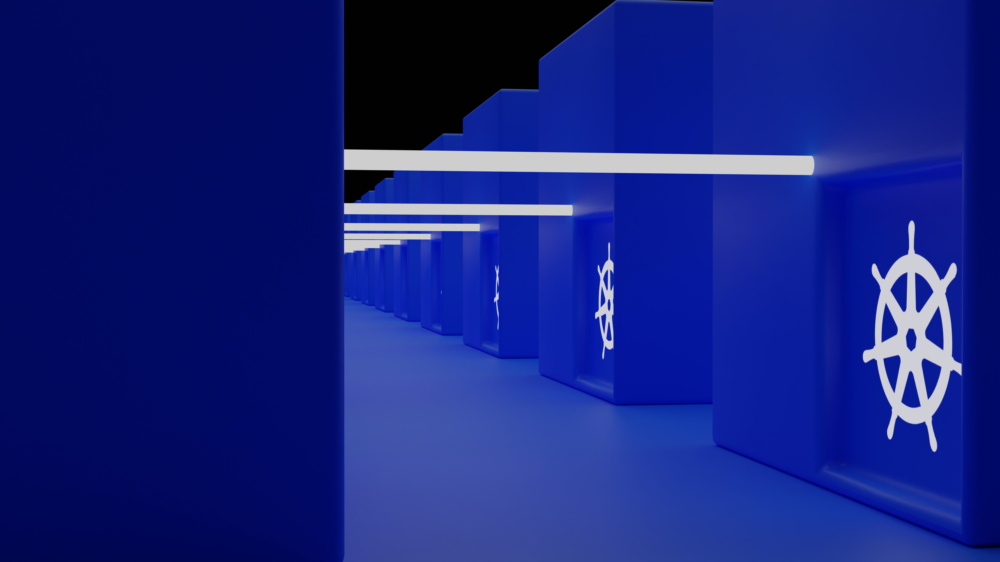

## 简介

当下云原生浪潮算是推到了巅峰，Kubernetes 是云原生技术中最为🐂X 的了。Kubernetes 是一个较为复杂的项目，学习成本也比较高，到底要掌握到什么程度，我认为可以根据个人工作职责来定位，如果个人有兴趣可以参考以下，一直递进学习~

业务开发：

- 了解 Kubernetes、Docker 的作用
- 掌握 Dockerfile/Yaml/Chart 以及常用的 Kubectl 命令
- 掌握 Kubernetes 一些常用资源对象的作用，例如：Deployment、Service、Configmap 等
- 知道一个服务怎样才能部署到 Kubernetes 中

Kubernetes 运维：

- 如何快速部署一个高可用 Kubernetes 集群
- 能够从全局的角度掌握 Kubernetes 每个组件的作用和工作原理，包括一些常用的 CRI、CSI、CRI
- 具备定位、解决 Kubernetes 的疑难杂症
- 掌握 Golang 语言，可以看懂 Kubernetes 源码，这个对以后定位问题非常有帮助 (可选)

Kubernetes 开发：

- 掌握 Golang 语言，具备阅读 Kubernetes 源码的能力
- 掌握 Kubernetes 常用 SDK 使用，例如：Client-go，Controller-runtime 等
- 掌握 Kubernetes 管理平台开发
- 掌握 Operator 开发，能够根据场景设计 CRD 以及 Kube-apiserver 聚合 API 开发
- 掌握 admission Webhook 开发
- 能够自定义 CNI、CSI、CRI、Scheduler-framework、Device-plugin 等
- 持续关注 Kubernetes 社区与 CNCF 社区等

## 技术栈

上面三种工作分类基本能够包含 Kubernetes 技术所有内容，内容由浅入深，比如云原生开发肯定需要掌握业务开发、K8S 运维那些技能。

下面列出了关于 Kubernetes 开发的技术栈路线图，仅供参考。

## 总结

上面只是简单列出了学习技术栈路线图，具体细节内容我会不定期更新，自己也是在创作的同时不断学习，希望自己能坚持下来~